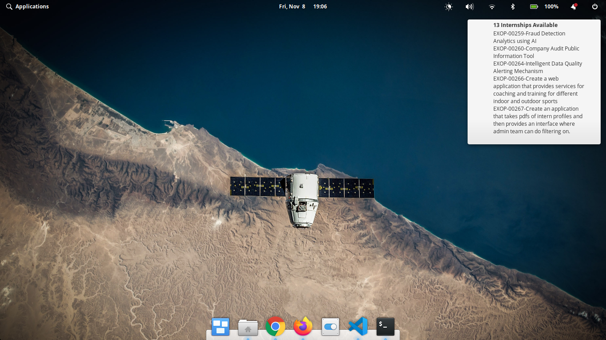

# TCSInternshipChecker

A tool to check the number of internships being offered at the [TCS Campus Commune website](https://campuscommune.tcs.com/en-in/intro) and notify via a Linux Notification.

## Tools Needed

- Google Chrome browser
- Chromedriver
- Python

## How to Run

1. Copy your TCS Reference Number to `TCSREFNUMBER` and TCS Campus Commune Password to `TCSPASSWORD` in  `CREDENTIALS.py`.
2. Run `pip install -r requirements.txt` in order to install all dependencies. [Installing dependencies in a virtual environment is recommended.](https://packaging.python.org/guides/installing-using-pip-and-virtual-environments/).
3. Run `python notifier.py` and receive notifications on your Linux environment every 3 minutes.

####Note

Please check your Chrome version and replace the `chromedriver` binary with the version compatible with your Google Chrome version from [here](https://chromedriver.chromium.org/downloads).

## Screenshots

